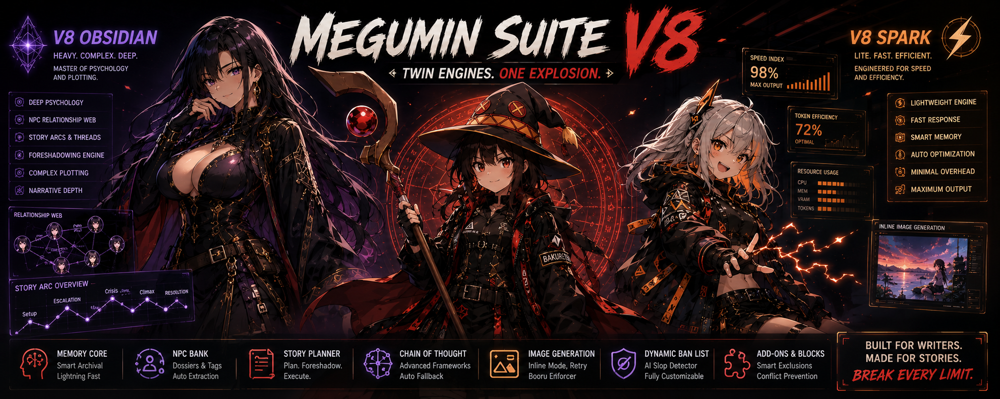
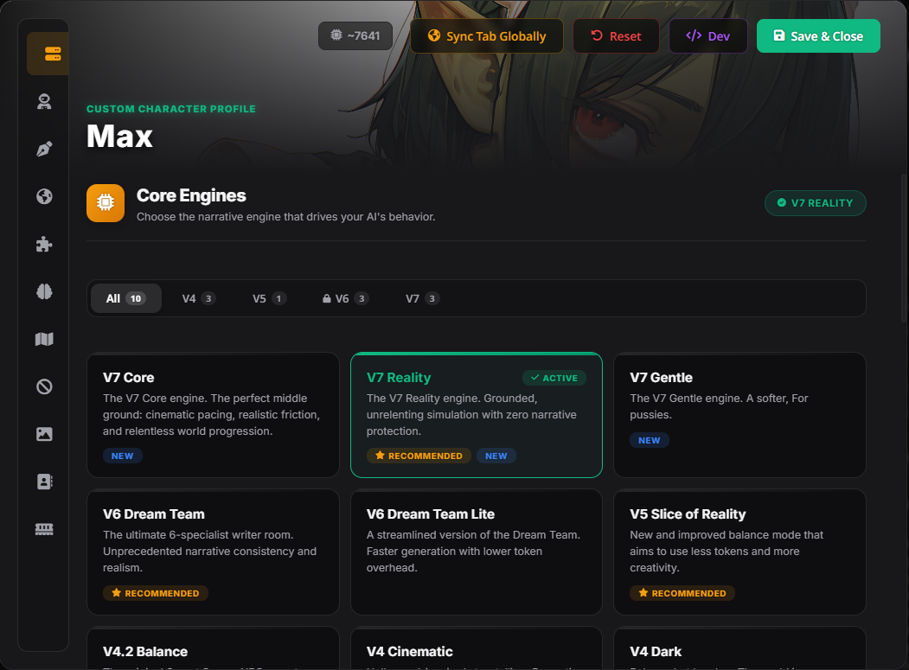
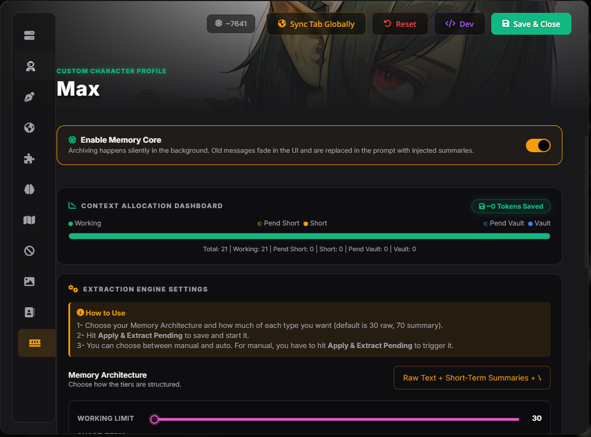
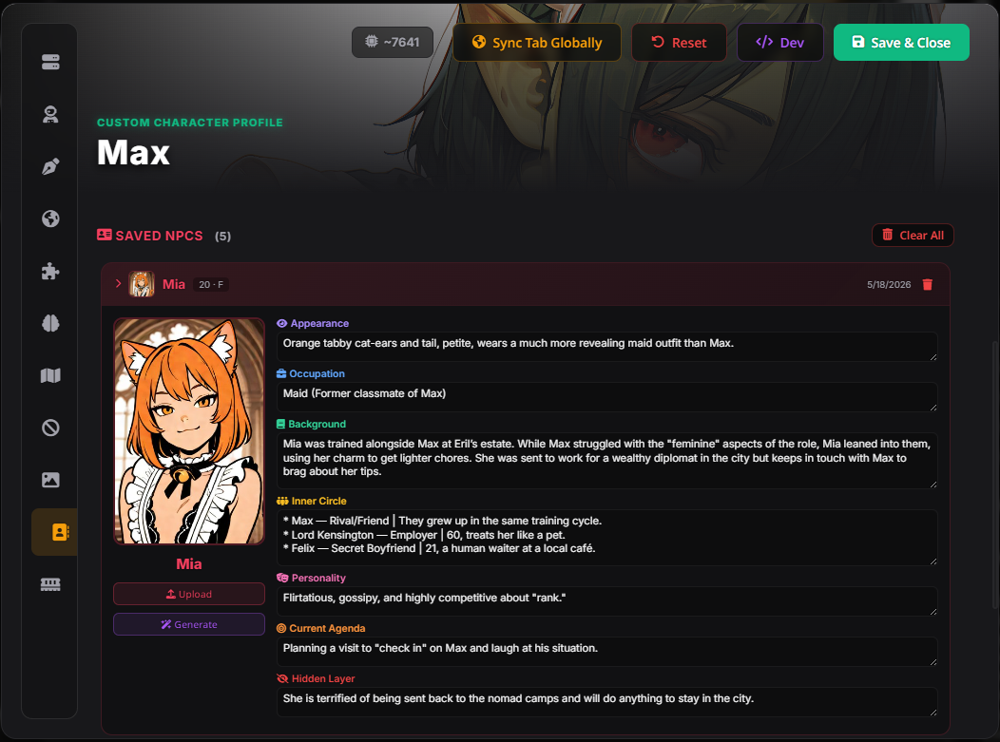
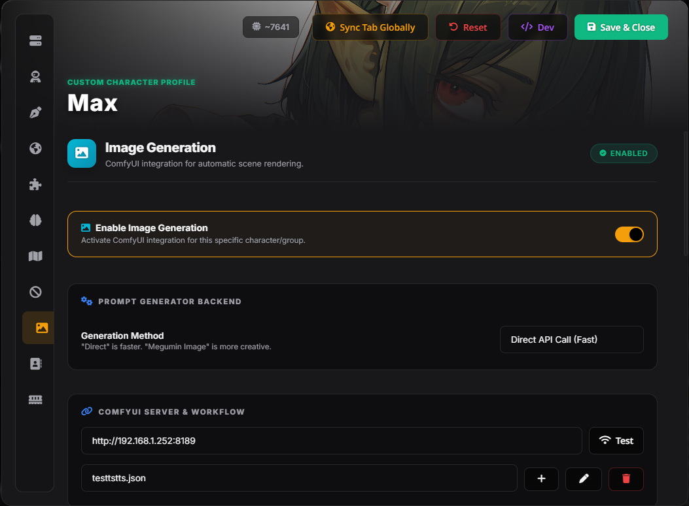

<div align="center">

<!-- Replace with your actual banner image -->


[](https://github.com/SillyTavern/SillyTavern)
[](#)
[](https://creativecommons.org/licenses/by-nc-nd/4.0/)

> *"Everything your preset should have been: persistent memory, chain-of-thought reasoning, automated NPC tracking, and ComfyUI image generation in a single install."*

**Megumin Suite** is a full-stack overhaul to how SillyTavern presets work. It replaces your preset, your memory system, your NPC management, and your image Generation — all in one extension. V8 introduces the new **Obsidian**, **Spark**, and **Fusion** engines with unprecedented dialogue realism, a completely redesigned **NPC Dossier** template, **Inline Image Generation**, and fully editable prompts across every subsystem.

[Features](#-core-features) • [Installation](#%EF%B8%8F-installation) • [The V8 Engines](#the-v8-engines) • [Memory Core](#-memory-core-3-tier-context) • [Image Gen](#image-gen-kazuma-comfyui)

</div>

---

## 🚀 What's New in V8?

V8 marks a huge step forward in terms of story quality, NPC depth, and user controls.

*   **V8 Obsidian Engine:** A complete rewrite that's all about obsession with psychology, dialogue, and story arcs. Has a strict hierarchy of priorities, story and sub-story arcs, and some of the most stringent dialogue rules against AI slop in the preset family.
*   **V8 Spark Engine:** A much lighter version of the Obsidian engine that retains all the same rules about psychology, dialogue, and story momentum without the high token costs.
*   **V8 Fusion Engine:** The best of both worlds – a mix of the deep psychology rules in V8 Obsidian and the V6 Dream Team framework, which involves having six specialized writer roles (NORA, ANVIL, OPUS, JULIA, MIKI).
*   **V7.5 Kismet Engine (Bonus):** Initially planned for its own V7.5 release, the Kismet engine was instead integrated into V8. This engine is all about the story.
*   **Redesigned NPC Dossier Template:** This is a completely revamped NPC Dossier that contains many new categories, including **Role**, **Where to find them**, **Voice** (the way they speak), **Image Tags** (for ComfyUI's Booru tags), **Read on the PC**, **Tiered Secrets** (semi-public → private → hidden), **Canon Lock** (immutably true facts about the character), and **Orientation**. The template also comes with trigger criteria to ensure that the AI will not create a dossier unless absolutely necessary.
*   **Inline Image Generation:** Images are generated directly inline with the AI's response instead of posting them separately as part of a gallery. Includes individual retry buttons for each image.
*   **Fully Editable Prompts:** All subsystems (Story Planner, Ban List, Image Gen, Memory Core, NPC Bank) now have an "Advanced: Edit Prompts" panel in which users can edit all the templates for prompts sent to the AI. The edits are enabled/disabled via a toggle and are saved individually per profile.
*   **Image Gen Overhaul:** Instead of using style and perspective dropdowns, there's now a **Prompt Template** system (six preset options: Illustrious/Z Image × POV/Cinematic/Portrait). There are additional toggles for **Include Examples**, **Better Booru Tags** (direct NSFW language), **Inject NPC Tags** (inject the saved NPC image tags into the prompts), and multiple images per response (one to four).
*   **Auto-CoT Matching:** Using a CoT framework other than V9 and selecting V7, V7.5, V8, or V8Fusion will automatically update your chosen framework accordingly.
*   **NPC/OOC Keyword Trigger:** Avoid using unnecessary tokens by only injecting a new NPC dossier template if your input contains either of the key phrases "NPC" or "dossier". (Example: "Create an NPC dossier for the bartender")
*   **"Scan Story" Button for NPC Bank:** You can manually scan your story and extract all your significant NPCs in one go — there's no need for the AI to do so in real time while chatting.
*   **Customizable Chunk Size for Memory Core:** Customize how many messages are processed per chunk (between 10 and 40).
*   **Draggable Button:** The wand button in the Megumin suite can be easily dragged and positioned to any location on the page, with persistent positions after session restarts.
*   **Live Token Counter Accuracy:** The Token Counter now calculates tokens at a `4.8` chars/token ratio (matching modern efficient tokenizers like Claude/GPT-4). It also now intelligently ignores highly variable dynamic blocks (like Memory Vaults and NPC lists) to give you a stable, accurate "Base Payload" estimation.
*   **New Writing Style Interface Design:** Updated the old stacked menu design to a more intuitive sidebar-based navigation panel, containing Precooked, My Library, and AI generators. Also removed the need for separate pages for DN Ratio & POV selectors.
*   **Min/Max Words Toggle:** Switch between specifying either minimum or maximum target word count for writing prompts.
*   **Optimizations:** Memory Core uses cached Set lookups to determine if a message is archived in O(1), paginates accordion/vaults (only loading 20 items at a time with a "load more" option), debounce visual updates, and caches token counts.

---

## 🌟 Core Features

### The V8 Engines
The V8 series constitutes the pinnacle of narrative engines in the Suite's history.

*   **V8 Obsidian:** The king. No other narrative engine excels at portraying complex human psychology, realistic flawed dialogues, and multi-layered autonomous story plot generation. Equipped with an official 7-rule priority hierarchy, structured storyline (Main Arc + 3 Subplots + Micro-Tensions), foreshadowing methodology, causality and consequences, agenda-as-plot-motor of NPCs, and by far the most aggressive anti-slop dialogue.
*   **V8 Spark:** All of the above rules condensed into a compact set of instructions taking up less tokens than the Obsidian version. For use on light models that find the Obsidian engine too cumbersome.
*   **V8 Fusion:** Combines the best from V8 Obsidian (psychology, dialogue engine) with the V6 Dream Team approach of a 6-specialist writer room (NORA, ANVIL, OPUS, JULIA, MIKI). Each of the 6 specialists is responsible for a particular type of writing: NORA ensures continuity, ANVIL handles psychology, OPUS constructs the plot, JULIA writes the narration, and MIKI creates dialogues.

> 📝 **Note:** V8 engines lock the Persona & Toggles tab automatically. This is because V8 engines utilize their native persona and narrative settings system, which conflicts with any external injection.

### Automated NPC Bank
A persistent character database that tracks every NPC accurately across sessions.
*   **Auto-Extraction:** When a significant NPC is introduced, the AI writes a detailed dossier and saves it to the bank.
*   **Redesigned Dossier Template:** The V8 dossier is dramatically more detailed than V7. NPCs now include **Role**, **Where to Find Them**, **Voice** (how they speak), **Image Tags** (Booru tags for ComfyUI), **Read on the PC** (what the NPC currently thinks of the player), **Tiered Secrets** (semi-public → private → buried), and **Canon Lock** (immutable facts that can never change). The template also includes strict trigger conditions — dossiers are only generated for characters who are **Named**, **Voiced** (more than a transactional line), and **Staked** (have a want or role that affects the story). No more dossiers for cashiers and bartenders.
*   **Dynamic Injection:** Scans your last 4 messages and injects relevant NPC dossiers into the prompt so the AI remembers them accurately.
*   **Image Tags Only Mode:** Per-NPC toggle to hide the text dossier from the AI (saving tokens) while still making their Booru image tags available to ComfyUI.
*   **OOC Trigger:** Save tokens by only injecting the blank dossier template when you mention "NPC" or "dossier" in your message.
*   **Scan Story:** Manually scan your entire chat history and extract all significant NPCs at once.
*   **AI Portrait Studio:** Click a button to have ComfyUI automatically generate a character portrait based purely on the AI's physical description of them.

### Advanced Chain of Thought (CoT)
Manually control the AI’s internal thought process prior to text generation.
*   **Master Toggle:** Enable/Disable CoT.
*   **Auto-matching:** The selection of any V7/V7.5/V8 will automatically set your CoT to the correct version.
*   **The 5-Phase Audit (V7):** *Ground Truth -> Plot Engine -> Scene Design -> Active Draft -> Correction Loop*.
*   **V8 CoT:** A streamlined 7-step thinking process (INPUT -> STORY -> NPCs -> DRAFT DIALOGUE -> DIALOGUE KILL CHAIN -> NARRATION -> FINAL).
*   **V8 Fusion CoT:** Brief thinking prompts specific to the writer room framework.
*   **V7.5 Kismet CoT:** Story Engine-based thoughts that include vocabulary gate checks & arc phase.

### Image Gen Kazuma (ComfyUI)
Hook up your own personal ComfyUI instance to your bot to create images on the fly during roleplay.
*   **Inline Mode:** Images are displayed directly in text with individual image-specific retries in the AI text reply.
*   **Gallery Mode:** Images appear as individual galleries (the default way).
*   **Prompt Templates:** Includes 6 templates (Illustrious/Z Image × POV/Cinematic/Portrait), complete with full rules and example images.
*   **Multi-Image Creation:** Create from 1-4 images in one AI reply.
*   **Inject NPC Tags:** Save and automatically insert NPC Booru image tags into prompts when relevant NPCs are involved.
*   **Improved Booru Tags:** Ensures that the AI uses specific and unembellished Danbooru tags with all applicable NSFW tags.
*   **LoRA Lab & Parameters:** Fine-tune Steps, CFG, Denoise, and 4 LoRA slots in SillyTavern.

### Dynamic Ban List (AI Slop Detector)
Fed up with the AI repeating phrases like *"a shiver ran down your spine"* and *"testament to..."*?
*   Select **Analyze Chat** and let the AI analyze your last 50 messages, finding the 5 most common crutch phrases that you use.
*   Turns them into hard bans automatically, preventing the AI from ever using them again in the future.
*   **Import/Export** ban list as JSON to transfer it between profiles.

### Story Planner & Blocks
*   **Story Planner:** Generates ideas for future plot twists, following at least 10 upcoming milestones.
*   **World State Tracker:** Inserts a dynamic collapsible panel displaying the world state including the date, weather, PC's current condition, NPC goals, planted seeds, consequences countdowns, and story progression phases.
*   **NPC Inner Chatter:** Makes the AI generate an invisible block of conversation revealing the thoughts of your NPCs.

### Memory Core (3-Tier Context)
Keep track of the story and stop burning tokens on bloated context windows.
*   **Working Memory:** The most recent conversation logs.
*   **Short-Term Memory:** Automatically generated summaries by the background service of previous chunks.
*   **Long-Term Vault (Vector DB):** Applies either **TF-IDF Keyword Matching** or **SillyTavern's Semantic Embeddings** to retrieve relevant archived memories and feed them back into the prompt without you knowing.
*   **Prompt Interceptor:** Automatically strips out any archived messages from the prompt and saves thousands of tokens.
*   **Configurable Chunk Size:** Control how many messages to sumarize at once ranging from 10 to 40 messages.
*   **"Every Reply" Auto-Trigger:** You can enable memory retrieval to happen each time the AI replies automatically.

> 📝 **Note:** Memory Core is **not** for advanced users. This is an easy way for users with up to 1000 message conversations to save their context space without managing any manual summaries.

### Fully Editable Prompts
Every subsystem now includes an **"Advanced: Edit Prompts"** collapsible panel:
*   Customize the system prompt, user task prompt, thinking instructions, and injection templates for **Story Planner**, **Ban List**, **Image Generation**, **Memory Core**, and **NPC Bank**.
*   Each editor has an enable/disable toggle — disabled means the default prompts are used.
*   Custom prompts are saved per-character/per-group profile.

---

## ⚙️ Installation

1. Open SillyTavern.
2. Go to the **Extensions** menu (the block icon).
3. Click **Install Extension**.
4. Paste the repository URL:
   ```text
   https://github.com/Arif-salah/Megumin-Suite
   ```
5. Refresh SillyTavern.
6. Download the JSONs files from this repo: https://github.com/Arif-salah/Megumin-Suite/tree/main/Presets
> ⚠️ **Note:** If you download these on your phone and your browser renames them to `.json.txt`, you **must** use a file manager to rename them and delete the `.txt` part. Furthermore, make sure the Engine file is named EXACTLY `Megumin Engine.json` before you import it. The Suite file's name doesn't matter, but the Engine must be exact.
7. Open SillyTavern, go to the **Ai  Response configuration** tab.
8. Click the **Import Preset** button (the little folder with an arrow) and upload the json files.
9. Once imported, open your preset dropdown and **make sure "Megumin Suite" is the active preset.** The extension handles the Engine silently in the background.


or just watch the **Install video:** [youtube Video](https://www.youtube.com/watch?v=Q-iaz9mBFrA) 


> **💡 Pro Tip:** - Megumin Suite V8 DS4 is for Deepseek.
                      - Megumin Suite V8 Gemini is for gemini models.
                      - Megumin Suite V8 Claude+GLM you know for what.
if you have model not here just try.

> ⚠️ **Important:** Megumin Suite ships with several **Regex scripts** that clean and format messages before they're sent to the AI. After installing, go to the **Extensions → Regex** panel and **make sure all Megumin-related regex entries are enabled**.

---

## 🕹️ Quick Start Guide

<div align="center">
  
  
  
  
</div>

1. **Select an Engine:** Open the Megumin Suite menu (wand icon) and pick a Core Engine. **V8 Obsidian** or **V8 Fusion** are recommended for the best experience.
2. **Set your Style:** Go to the Writing Style tab. The V8 Default style (witty, opinionated observer) is applied automatically. Customize it or choose from precooked styles.
3. **Enable CoT:** Go to the Chain of Thought tab — it's enabled by default and auto-matches your engine version.
4. **Chat!** The extension will handle all prompt injection, formatting, and memory management silently in the background.

> **💡 Pro Tip:** If you want to see exactly what Megumin Suite is sending to the AI under the hood, enable **Prompt Payload Preview** in the Global Settings tab.

---

## 🛠️ Troubleshooting & Tips


*   **LLMs:** Designed for highly capable instruction-following models (Claude 4.6 Sonnet/Opus, DeepSeek v4, Gemini 3.1 pro/flash, GLM 5.1). Smaller local models may struggle with the strict V8 CoT instructions. use v8 spark for small LLMs.
*  **Does this extension mess with my other presets?** No — your other presets will work just fine. Megumin Suite only injects its rules into its own designated preset (Megumin Suite). Your existing presets remain completely untouched.
* **Vector Storage (Optional):** if you using Semantic Embeddings in the Memory Core, you can change the model its  Cohee/jina-embeddings-v2-base-en by default if it heavy for your pc use Xenova/all-MiniLM-L6-v2 you can change it inside  "sillytavern\config.yaml"
* **Old Versions:** Legacy docs are here: [Megumin Suite v4 Legacy Readme](https://github.com/Arif-salah/Megumin-Suite/tree/V4.1)  [Megumin Suite v5 Legacy Readme](https://github.com/Arif-salah/Megumin-Suite/tree/V5) [Megumin Suite v6 Legacy Readme](https://github.com/Arif-salah/Megumin-Suite/tree/V6) [Megumin Suite v7 Legacy Readme](https://github.com/Arif-salah/Megumin-Suite/tree/V7)

---

## 🤝 Credits & Acknowledgements

*   Built natively for the [SillyTavern](https://github.com/SillyTavern/SillyTavern).
*   MVU Compatibility integration inspired by [KritBlade's MVU Game Maker](https://github.com/KritBlade/MVU_Game_Maker).

---

<div align="center">

### 💜 Support the Project

Megumin Suite is free and always will be. If it saved you hours of prompt engineering or made your sessions better, consider tossing a few bucks it keeps development alive and the updates coming.

🪙 **Crypto (LTC):** `LSjf1DczHxs3GEbkoMmi1UWH2GikmXDtis`

⭐ *Not in a position to donate? Starring the repo and sharing it helps just as much.*

</div>